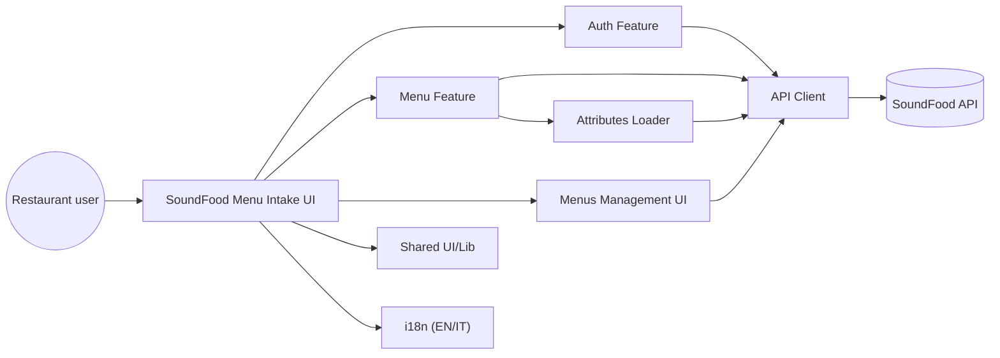

# SoundFood — Menu Intake Frontend

[](LICENSE)
[](https://github.com/matteospanio/sf-demo-menu-intf/actions/workflows/ci.yml)
[](https://nodejs.org/)
[](https://www.typescriptlang.org/)

This repository contains a **React + TypeScript** web interface used to **collect restaurant menu data** and send it to the **SoundFood API**.

SoundFood creates tailored music experiences for restaurants to enhance the perceived flavors of dishes. This app focuses on *data collection*: menus, dishes, and dish-specific sensory attributes (tastes, colors, textures, shapes, emotions, etc.).

## Features

- **Authentication**
  - Register, login, logout
  - Token persisted in `localStorage` (`auth_token`)
- **Menu request creation**
  - Create a menu (title required, description optional)
  - Add multiple dishes to the menu
  - Reorder dishes via drag & drop
- **Menu request management**
  - View the list of your created menus
  - Open menu details
  - Update an existing menu request
  - Delete a menu
- **Dish description (modal editor)**
  - Section/category selection (e.g., appetizer, first course, …)
  - Taste sliders (sweet/bitter/sour/salty/umami + piquant/fat/temperature)
  - Colors (up to 3)
  - Select **textures**, **shapes**, **emotions** fetched from the API
  - Edit and delete existing dishes
- **Submission & summary**
  - Submit creates the menu + dishes on the API
  - A full-screen summary drawer shows the submitted menu and dishes
- **Internationalization (i18n)**
  - English and Italian
  - Language switcher in the top bar

## Tech stack

- **React 18**, **TypeScript**, **Vite**
- **Chakra UI** (+ `chakra-react-select`, `chakra-multiselect`)
- **i18next** (`react-i18next` + http backend)
- Testing: **Vitest** (unit) + **Playwright** (E2E)

## Architecture

The codebase is organized by **feature slices** and shared building blocks:

- `src/features/auth` — auth state (context) and the login/register UI
- `src/features/menu` — menu request form, dish editor, and attribute loaders
- `src/api` — API client + typed services
- `src/shared` — reusable UI + utilities

More details in [src/README.md](src/README.md).

## Requirements

- Node.js **20+** (CI uses Node 20)
- A package manager:
  - Recommended: `yarn` (used in CI)
  - Also works: `npm`
- Access to a compatible **SoundFood API** with these endpoints:
  - Auth: `/auth/register`, `/auth/login`, `/auth/logout`, `/auth/me`
  - Menus: `/api/menus`
  - Dishes: `/api/menus/:menuId/dishes`, `/api/dishes/:id`
  - Attributes: `/api/emotions`, `/api/textures`, `/api/shapes`

## Installation

Using Yarn:

```bash
yarn install
yarn dev
```

Using npm:

```bash
npm install
npm run dev
```

Then open the URL printed by Vite.

## Configuration

### Environment variables

This app reads the API base URL from a Vite env var.

- `VITE_API_BASE_URL` — SoundFood API base URL (default: `http://localhost:5000`)

Create a local `.env` file (starting from `.env.example`):

```bash
cp .env.example .env
```

### GitHub Pages base path

The project is configured with Vite `base: "/sf-demo-menu-intf/"` for GitHub Pages deployments.
Translations are loaded via i18next from `/sf-demo-menu-intf/locales/...`.

## Tests

### Unit tests (Vitest)

```bash
yarn test
# or
yarn test:run
yarn test:coverage
```

### E2E tests (Playwright)

Playwright starts the dev server automatically and runs tests in `e2e/`:

```bash
yarn test:e2e
```

Notes:

- Some E2E tests are marked as `skip` and document expected behavior for a fully authenticated scenario.
- Full E2E coverage typically requires a reachable API (or a mock API).

## CI

The GitHub Actions workflow runs:

- ESLint + TypeScript typecheck
- Unit tests + coverage artifacts
- Playwright E2E across Chromium/Firefox/WebKit

See [.github/workflows/ci.yml](.github/workflows/ci.yml).

## User stories (what you can do in the app)

- As a restaurant user, I can **register** and **log in** to access the menu intake form.
- As a restaurant user, I can **create a menu request** with a title and optional description.
- As a restaurant user, I can **add multiple dishes** to the menu.
- As a restaurant user, I can **describe each dish** through:
  - section/category
  - taste intensity sliders
  - temperature/fat/piquant parameters
  - visual cues (up to 3 colors)
  - selectable textures/shapes/emotions loaded from the API
- As a restaurant user, I can **edit** or **delete** dishes before submitting.
- As a restaurant user, I can **reorder dishes** to match the menu order.
- As a restaurant user, I can **submit** the menu request, sending menu + dishes to the SoundFood API.
- As a restaurant user, I can **review a summary** of what was submitted.
- As a restaurant user, I can **see the list of my created menus**, open details, **edit**, and **delete** a menu.
- As a user, I can **switch language** (EN/IT) from the top bar.
- As a user, I can **log out**.

## Mermaid UML diagrams

### Component diagram



### Sequence diagram — submit menu


### Sequence diagram — manage menus (list / view / edit / delete)


### Class diagram — API domain types


### State diagram — auth


## License

This project is licensed under the Apache-2.0 License - see the [LICENSE](LICENSE) file for details.
