# SoundFood — Menu Intake Frontend

[](LICENSE)
[](https://github.com/SoundFoodPhygital/menu-client/actions/workflows/ci.yml)
[](https://nodejs.org/)
[](https://www.typescriptlang.org/)
[](https://react.dev/)
[](https://vitejs.dev/)
[](https://chakra-ui.com/)
[](https://vitest.dev/)
[](https://playwright.dev/)
[](https://www.i18next.com/)
[](https://www.docker.com/)
[](https://deepwiki.com/SoundFoodPhygital/menu-client)

> A **React + TypeScript** web interface for collecting restaurant menu data and sending it to the **SoundFood API**.

SoundFood creates tailored music experiences for restaurants to enhance the perceived flavors of dishes. This app focuses on *data collection*: menus, dishes, and dish-specific sensory attributes (tastes, colors, textures, shapes, emotions, etc.).

---

## Table of Contents

- [Features](#features)
- [Tech Stack](#tech-stack)
- [Project Structure](#project-structure)
- [Getting Started](#getting-started)
  - [Prerequisites](#prerequisites)
  - [Installation](#installation)
  - [Configuration](#configuration)
- [Development](#development)
  - [Available Scripts](#available-scripts)
  - [Testing](#testing)
- [Deployment](#deployment)
  - [Docker](#docker)
  - [GitHub Pages](#github-pages)
- [Architecture](#architecture)
  - [System Overview](#system-overview)
  - [Data Flow](#data-flow)
  - [Domain Model](#domain-model)
  - [State Management](#state-management)
- [Documentation](#documentation)
- [Contributing](#contributing)
- [License](#license)

---

## Features

| Category | Features |
|----------|----------|
| 🔐 **Authentication** | Register, login, logout with token persistence |
| 👤 **Profile** | View profile, update email, change password |
| 📋 **Menus** | Create, edit, delete, save as draft, submit |
| 🍽️ **Dishes** | Add, edit, delete, reorder via drag & drop |
| 🎨 **Sensory Attributes** | Taste sliders, colors (up to 3), textures, shapes, emotions |
| 🌍 **i18n** | English and Italian with language switcher |

---

## Tech Stack

| Category | Technology |
|----------|------------|
| **Framework** | React 18 + TypeScript |
| **Build Tool** | Vite 5 |
| **UI Library** | Chakra UI 2.x |
| **State** | React Context + Reducers |
| **i18n** | i18next |
| **HTTP Client** | Fetch API (custom wrapper) |
| **Unit Testing** | Vitest |
| **E2E Testing** | Playwright |
| **Deployment** | Docker + Nginx / GitHub Pages |

---

## Project Structure

```
src/
├── api/                 # API client, services, and types
│   ├── client.ts        # HTTP client with auth handling
│   ├── services.ts      # API service functions
│   └── types.ts         # TypeScript interfaces
├── features/            # Feature-based modules
│   ├── auth/            # Authentication (context + UI)
│   │   ├── model/       # AuthContext
│   │   └── ui/          # LoginPage, ProfilePage
│   └── menu/            # Menu management
│       ├── hooks/       # useAttributes, etc.
│       ├── model/       # Dish types
│       └── ui/          # MenuForm, DishCard, etc.
├── shared/              # Shared utilities and components
│   ├── config/          # Constants
│   ├── lib/             # Utilities (storage, helpers)
│   └── ui/              # Reusable UI components
├── hooks/               # Global custom hooks
├── test/                # Test setup and utilities
├── App.tsx              # Main app component
├── i18n.ts              # i18next configuration
└── theme.ts             # Chakra UI theme

e2e/                     # Playwright E2E tests
public/locales/          # Translation files (EN/IT)
docs/                    # Documentation
```

More details in [src/README.md](src/README.md).

---

## Getting Started

### Prerequisites

- **Node.js 20+** (CI uses Node 20)
- **Yarn** (recommended) or npm
- Access to a compatible **SoundFood API**

### Installation

```bash
# Clone the repository
git clone https://github.com/SoundFoodPhygital/menu-client.git
cd menu-client

# Install dependencies
yarn install

# Start development server
yarn dev
```

### Configuration

Create a `.env` file from the template:

```bash
cp .env.example .env
```

| Variable | Description | Default |
|----------|-------------|---------|
| `VITE_API_BASE_URL` | SoundFood API base URL | `http://localhost:5000` |
| `VITE_BASE_PATH` | Base path for hosting (production) | `/` |

---

## Development

### Available Scripts

| Command | Description |
|---------|-------------|
| `yarn dev` | Start development server |
| `yarn build` | Build for production |
| `yarn preview` | Preview production build |
| `yarn lint` | Run ESLint |
| `yarn test` | Run unit tests (watch mode) |
| `yarn test:run` | Run unit tests once |
| `yarn test:coverage` | Run tests with coverage |
| `yarn test:e2e` | Run Playwright E2E tests |

### Testing

#### Unit Tests (Vitest)

```bash
yarn test          # Watch mode
yarn test:run      # Single run
yarn test:coverage # With coverage report
```

#### E2E Tests (Playwright)

```bash
yarn test:e2e         # Headless
yarn test:e2e:headed  # With browser UI
yarn test:e2e:debug   # Debug mode
```

> **Note:** Full E2E coverage requires a reachable API or mock server.

---

## Deployment

### Docker

Build and run with Docker:

```bash
# Build image
docker build \
  -t menu-client \
  --build-arg VITE_BASE_PATH=/ \
  --build-arg VITE_API_BASE_URL=http://localhost:5000 \
  .

# Run container
docker run --rm -p 8080:80 menu-client
```

Or use Docker Compose:

```bash
docker compose up --build
```

Open `http://localhost:8080`.

### GitHub Pages

The production build defaults to `VITE_BASE_PATH=/menu-client/` for GitHub Pages:

```bash
yarn build
yarn deploy
```

---

## Architecture

### System Overview

```mermaid
flowchart TB
  subgraph Client["🖥️ Frontend (React + Vite)"]
    UI["UI Components"]
    Auth["Auth Feature"]
    Menu["Menu Feature"]
    API["API Client"]
    I18n["i18n"]
  end

  subgraph Backend["☁️ SoundFood API"]
    AuthAPI["Auth Service"]
    MenuAPI["Menu Service"]
    AttrAPI["Attributes Service"]
  end

  User((👤 Restaurant User)) --> UI
  UI --> Auth
  UI --> Menu
  UI --> I18n
  Auth --> API
  Menu --> API
  API --> AuthAPI
  API --> MenuAPI
  API --> AttrAPI
```



### Data Flow

#### Menu Submission Flow

```mermaid
sequenceDiagram
  autonumber
  actor U as 👤 User
  participant FE as Frontend
  participant API as SoundFood API

  U->>FE: Fill menu details
  U->>FE: Add dishes with attributes
  U->>FE: Click Submit

  FE->>API: POST /api/menus
  API-->>FE: { id: menuId }

  loop Each dish
    FE->>API: POST /api/menus/{menuId}/dishes
    API-->>FE: { id: dishId }
  end

  FE->>API: POST /api/menus/{menuId}/submit
  API-->>FE: { status: 'submitted' }

  FE-->>U: ✅ Success notification
  FE-->>U: Redirect to menus list
```



#### Menu CRUD Operations

```mermaid
sequenceDiagram
  autonumber
  actor U as 👤 User
  participant FE as Frontend
  participant API as SoundFood API

  Note over U,API: List Menus
  U->>FE: Open "My Menus"
  FE->>API: GET /api/menus
  API-->>FE: ApiMenu[]
  FE-->>U: Display menu list

  Note over U,API: View Details
  U->>FE: Select menu
  FE->>API: GET /api/menus/{id}
  FE->>API: GET /api/menus/{id}/dishes
  API-->>FE: Menu + Dishes
  FE-->>U: Display details

  Note over U,API: Delete Menu
  U->>FE: Delete menu
  FE->>API: DELETE /api/menus/{id}
  API-->>FE: { success }
  FE-->>U: Remove from list
```



### Domain Model


### State Management

#### Menu Status Lifecycle

```mermaid
stateDiagram-v2
  [*] --> Draft: Create menu

  Draft --> Draft: Edit / Save
  Draft --> Submitted: Submit

  Submitted --> Draft: Revert
  Submitted --> Submitted: Edit

  state Draft {
    [*] --> Valid
    Valid: ✓ Title required
    Valid: ○ Dishes optional
  }

  state Submitted {
    [*] --> Complete
    Complete: ✓ Title required
    Complete: ✓ At least 1 dish
  }
```



#### Authentication State


---

## Documentation

| Document | Description |
|----------|-------------|
| [README.md](README.md) | This file — project overview |
| [src/README.md](src/README.md) | Source code architecture details |
| [docs/REQUIREMENTS.md](docs/REQUIREMENTS.md) | User stories and functional requirements |
| [.github/copilot-instructions.md](.github/copilot-instructions.md) | Development guidelines for Copilot |

---

## Contributing

Contributions are welcome! Please follow the guidelines in [.github/copilot-instructions.md](.github/copilot-instructions.md):

1. Fork the repository
2. Create a feature branch (`git checkout -b feature/amazing-feature`)
3. Follow DRY and SOLID principles
4. Write tests for new features
5. Add translations (EN + IT)
6. Commit your changes
7. Open a Pull Request

---

## License

This project is licensed under the **Apache-2.0 License** — see the [LICENSE](LICENSE) file for details.

---

<div align="center">

**[SoundFood](https://soundfoodphygital.github.io/menu-client/)** — Enhancing flavors through music 🎵🍽️

</div>
